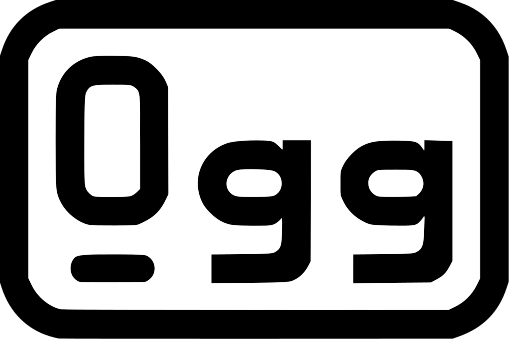

Custom LibOgg Build
--------------------

For playback, audio and video data are generally wrapped in a media container
that "multiplexes" the data - storing the first second of video, then audio,
then the next second and so on. If video and audio were were stored
separately, Blu-Ray players would have to do excessive head movements and
streaming would not work at all. OGG is such a media container and
an alternative to MP4 (`.m4v` / `.m4a`) and Matroska (`.mkv` / `.mka`).

libogg is a C/C++ library that helps figuring out the contents of `.ogg`
containers, reading their audio and video streams and metadata.

What's in this repository?
--------------------------

This `CMakeLists.txt` is a custom build that *blindly* assumes a modern
desktop Linux build environment / Windows Visual Studio environment
and skips all configure checks.

You should prefer the `CMakeLists.txt` that ships with libogg.

This one exists specifically for some of my "Nuclex" projects, where
I'm being pedantic about compiler settings. The `CMakeLists.txt` in this
repository takes all C/C++ compiler options from an external CMake include
file (`../../build-system/cmake/cplusplus.cmake`), thus making sure that
all libraries involved in my tools are compiled with the exact same compiler
settings and that i.e. PGO can be used from end to end.
